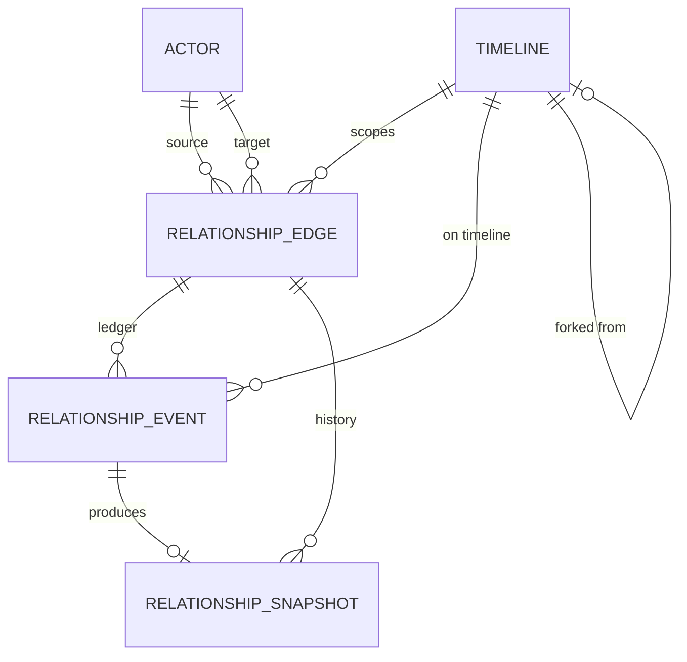

# Relationship Engine — Persistence / Database Schema (v0.2.0)

Design-only. NamoChat is **local-first**: no server, no auth, data lives in the browser. This
document defines a **logical schema** (entities + relations + invariants) and maps it onto the
concrete local persistence. The logical model is storage-agnostic so it can back today's Zustand +
`localStorage`, a v0.2 **IndexedDB** adapter (recommended — snapshot volume outgrows `localStorage`),
and an optional **SQLite/Drizzle** mapping for a future Tauri/Electron desktop build.

## 1. Why the store changes in v0.2

Today, relationship state is a tiny field embedded in the persisted `Chat`
(`chat.relationship = { affinity, stageIndex }`), serialized whole into one `localStorage` key by
Zustand `persist`. The v0.2 model adds an **append-only event ledger** and **periodic snapshots**,
which grow unbounded and are queried by edge/timeline. Keeping the whole thing in one JSON blob would
bloat every write. So v0.2 introduces dedicated collections behind a repository interface
(mirroring how `MemoryRepository` is swappable), while the *current-vector* stays inline on the chat
for cheap hot-path reads.

## 2. Logical entities

```
Actor {
  id            PK
  kind          'user' | 'character' | 'npc'
  displayName
  refId?        // character.id for kind='character'; null for the singleton user
}

RelationshipEdge {                       // directed A → B within a scope
  id            PK                        // = hash(sourceActorId, targetActorId, scopeId)
  sourceActorId FK → Actor.id
  targetActorId FK → Actor.id
  scopeId       FK → Timeline.id          // = chat/branch id
  vector        RelationshipVector        // current (hot) vector, 9 floats
  stageCache    string                    // last projected stage (display)
  attachmentCache string
  policy        CharacterRelationshipPolicy?   // resolved from card at creation
  createdAt, updatedAt, schemaVersion
  UNIQUE(sourceActorId, targetActorId, scopeId)
}

RelationshipEvent {                      // append-only ledger
  id            PK
  edgeId        FK → RelationshipEdge.id
  scopeId       FK → Timeline.id          // denormalized for fast timeline queries
  atMessageId?  FK → ChatMessage.id
  timestamp
  type          RelationshipEventType
  weight        'minor'|'moderate'|'major'|'pivotal'
  deltas        JSON (Partial<Record<Dimension, number>>)
  source        'user-pinned'|'auto-detected'|'memory-derived'|'system'
  confidence?   float
  note?         string
  appliedVectorId? FK → RelationshipSnapshot.id   // snapshot produced by applying this event
  INDEX(edgeId, timestamp), INDEX(scopeId, timestamp)
}

RelationshipSnapshot {                   // point-in-time projection, replay anchor
  id            PK
  edgeId        FK → RelationshipEdge.id
  scopeId       FK → Timeline.id
  atMessageId?  FK → ChatMessage.id
  timestamp
  vector        RelationshipVector
  stage         string
  attachmentStyle string
  recentEventIds JSON string[]           // ledger tail at this point
  schemaVersion
  INDEX(edgeId, timestamp)
}

Timeline {                               // = a chat or a branch; already exists as `Chat`
  id            PK
  parentTimelineId?  FK → Timeline.id     // set when forked (branch lineage)
  forkedAtMessageId? FK → ChatMessage.id
  characterId   FK
  ...existing Chat fields...
}
```

`RelationshipVector` is a fixed 9-float record: `{ trust, affection, respect, attachment,
dependence, familiarity, romanticInterest, conflict, fear }`.

## 3. Relationships (ER)



- One **edge per (source, target, timeline)**. The primary edge is `user → character` for a chat.
  The reverse `character → user` edge is optional (NPC autonomy). Future **NPC↔NPC** = two more
  edges with `kind='npc'` actors and the *same* schema — **no migration required** (P5).
- Events and snapshots are **children of an edge** and tagged with `scopeId` for timeline queries.

## 4. Invariants (enforced by the repository / app layer)

- **DB1** `UNIQUE(sourceActorId, targetActorId, scopeId)` — one live edge per pair per timeline.
- **DB2** `RelationshipEvent` is **append-only** (no updates/deletes in normal flow; corrections are
  new compensating events). Mirrors the memory/outbox discipline from the donor platform.
- **DB3** `edge.vector` MUST equal the vector of its latest snapshot (write them in one transaction /
  one store update). If they diverge, the ledger is authoritative and the edge is rebuilt by replay.
- **DB4** Deleting a `Timeline` cascades to its edges/events/snapshots (scoped cleanup), except
  events belonging to a **parent** timeline that a branch still references up to the fork point.
- **DB5** `familiarity` is monotonic per edge (SPEC F1) — enforced at write time as a guard.
- **DB6** All floats persisted in `[0,1]`.

## 5. Concrete mappings

### 5.1 v0.2 target — IndexedDB (browser, recommended)

Object stores (via the existing storage-guard pattern; degrade to in-memory on failure like
`MemoryRepository`):

| Object store | keyPath | Indexes |
|---|---|---|
| `actors` | `id` | `kind` |
| `relationshipEdges` | `id` | `scopeId`, `[sourceActorId+targetActorId]` |
| `relationshipEvents` | `id` | `[edgeId+timestamp]`, `[scopeId+timestamp]` |
| `relationshipSnapshots` | `id` | `[edgeId+timestamp]` |

Rationale: append-only ledgers + snapshots are exactly what `localStorage` (single blob, ~5 MB,
synchronous) handles badly and IndexedDB (indexed, async, large) handles well. The **hot vector**
stays inline on the chat so the render/prompt path never awaits IndexedDB.

### 5.2 Interim — Zustand `localStorage` (no new adapter yet)

For the first migration step, the new shapes can live inside the existing persisted store under a
new slice `relationships: { edges, events, snapshots }`, versioned by Zustand `persist`'s `version`
+ `migrate`. This ships the model without new infra; the IndexedDB adapter follows behind a
`RelationshipRepository` interface (swap without touching core). See MIGRATION_PLAN_v0.2 §Storage.

### 5.3 Optional — SQLite / Drizzle (future desktop)

The logical schema maps 1:1 to relational tables (the donor `sovereign-platform-v3` already proves a
Drizzle/SQLite pattern). `vector`/`deltas` persist as JSON columns or expanded float columns;
indexes as declared in §2. This mapping is **documented, not built** — chosen only if NamoChat gains
a desktop shell.

## 6. Storage budget & retention

- **Snapshot cadence:** on event application + timeline milestones — not per turn — to bound growth.
- **Ledger compaction (future):** old minor events beyond a horizon may be folded into a synthetic
  "baseline" snapshot (like memory summarization in NEXT_PHASE), preserving replayability of recent
  history while capping size. v0.2 defines the hook; compaction itself is deferred.
- **Export/import:** relationships travel with `ChatExport` (bump to `version: 2`) so backup/restore
  and branch portability keep the full edge/ledger/snapshot set (MIGRATION_PLAN §Export).

## 7. Security / privacy

Consistent with `CLAUDE.md`: no secrets in these records; everything stays on-device. Relationship
data is user content and never transmitted except in the user's own export file.
