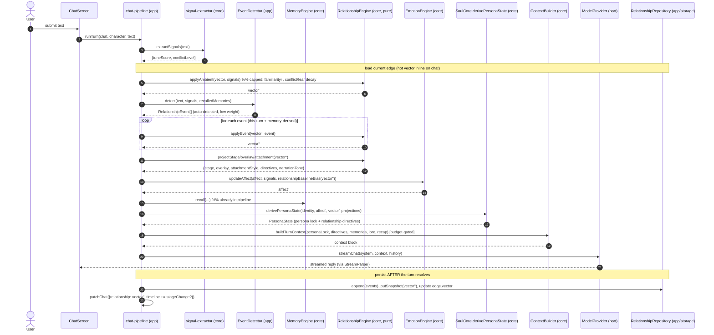
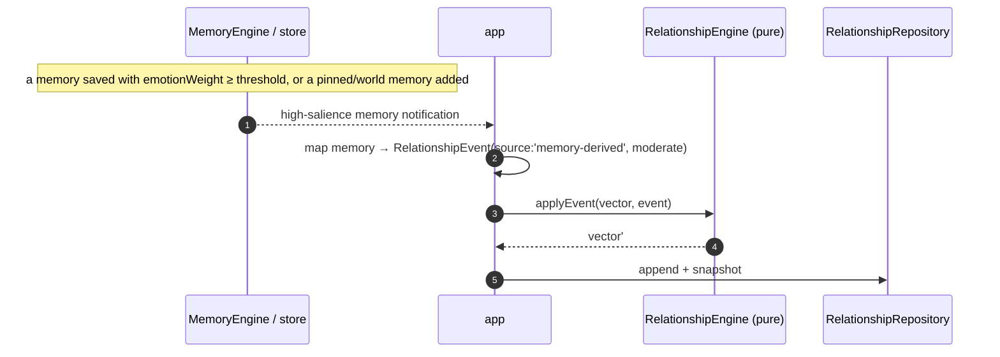
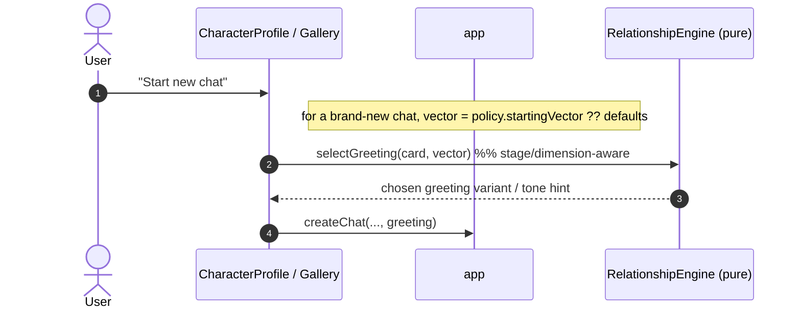

# Relationship Engine — Sequence Diagrams (v0.2.0)

Design-only. Shows where the engine sits in the existing turn pipeline
(`stores/chat-pipeline.ts`) and how events, projections, snapshots, and branching interact. The
**pure core** (RelationshipEngine, projections) never touches storage/LLM; the **application layer**
(pipeline + repository + detector) orchestrates.

## 1. Per-turn flow (send message)



Notes:
- **Ambient before events:** decay/familiarity first, then discrete events, so an apology in the same
  turn as its argument resolves against the freshest state.
- **Emotion reads relationship (one-way):** `relationshipBaselineBias` shifts the affect baseline
  (SPEC §7.6) — the two pure modules stay decoupled (bias is passed, not imported).
- **Persist last:** like the v0.1 pipeline, memory/relationship writes happen after the reply so a
  failed request never corrupts state; error text never becomes an event or memory.

## 2. User pins a meaningful event (authoritative)

```mermaid
sequenceDiagram
  autonumber
  actor U as User
  participant UI as ChatSidePanel / message action
  participant PIPE as app
  participant REL as RelationshipEngine (pure)
  participant REPO as RelationshipRepository

  U->>UI: "Mark moment" → pick type (e.g. confession_love), weight (pivotal)
  UI->>PIPE: pinEvent({type, weight, atMessageId})
  PIPE->>REL: applyEvent(vector, event{source:'user-pinned', confidence:1})
  REL-->>PIPE: vector'
  PIPE->>REPO: append(event), putSnapshot(vector'), update edge
  PIPE->>UI: timeline += event; relationship panel updates
```

User-pinned events are `confidence = 1` and may be `pivotal` — the only routine path to large,
intended changes (auto-detection stays low-weight by design).

## 3. Memory → Relationship (memory-derived event)



## 4. Branching a chat (snapshot fork)

```mermaid
sequenceDiagram
  autonumber
  actor U as User
  participant UI as MessageBubble (branch)
  participant CHAT as chat-store.forkChat
  participant REPO as RelationshipRepository

  U->>UI: "Branch from here" (messageId)
  UI->>CHAT: forkChat(chatId, messageId)
  CHAT->>REPO: copy edge+ledger+snapshots up to messageId into new scopeId
  Note over REPO: new Timeline{ parentTimelineId, forkedAtMessageId }
  CHAT-->>UI: navigate to branch (independent edge; diverges from here)
```

Two branches from the same point share history only up to the fork (invariant B1); events after the
fork accrue to their own scope.

## 5. Greeting selection on new chat (Relationship → Greeting)



For a **continued relationship** (e.g. a returning scope or a future persistent character-level
edge), `selectGreeting` reads the existing vector so the opener matches the current stage/overlay.
