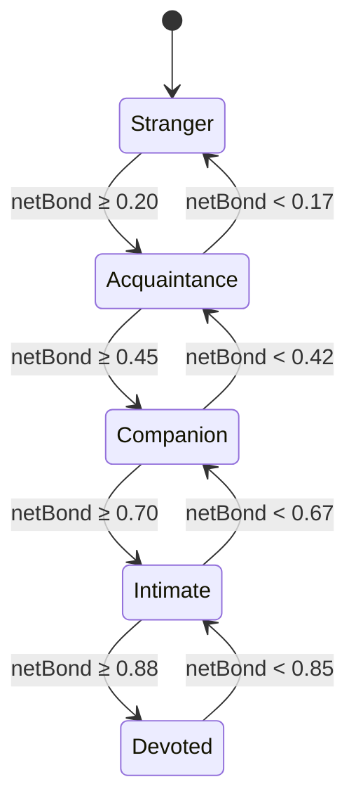
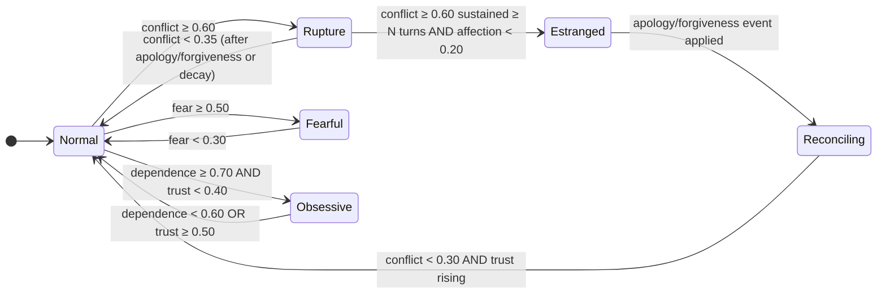
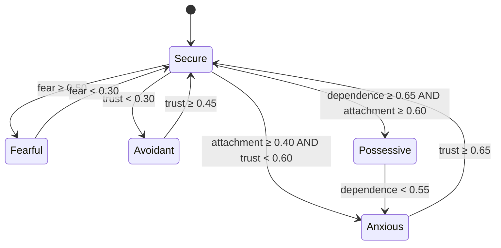

# Relationship Engine — State Machine (v0.2.0)

Design-only. The relationship's numeric **vector** is the source of truth (SPEC §3). "Stage,"
"overlay," and "attachment style" are **derived read-models** projected from the vector with
**hysteresis** so they don't flicker. This document defines those projections as state machines.

There are three orthogonal machines:
1. **Bond stage** — the primary Stranger→Devoted ladder (with platonic/romantic tracks).
2. **Overlays** — transient/mode states (Rupture, Fearful, Obsessive, Estranged) layered on the
   stage.
3. **Attachment style** — secure/anxious/possessive/avoidant/fearful.

## 1. Bond stage ladder

Driven by `netBond` (SPEC §7.1). Bands with **hysteresis margin** `H = 0.03` (enter a higher band at
`threshold`, drop only below `threshold − H`) prevent oscillation. Downward moves are further limited
to **one band per evaluation** (regression is gradual), matching the v0.1 hysteresis intent.

**Romantic track.** When `romanticInterest ≥ 0.5`, the same bands relabel to a romantic vocabulary
used by projections/UI (the underlying band is identical):

| Platonic label | Romantic label (romanticInterest ≥ 0.5) |
|---|---|
| Companion | Sweetheart |
| Intimate | Lover |
| Devoted | Beloved |

Crossing into the romantic track is itself a **meaningful transition** and SHOULD emit a
`system` timeline event ("became romantic").

## 2. Overlays (mode states)

Overlays are computed each evaluation and can coexist with any stage. They express acute conditions
the flat ladder can't, and they **take priority in projections** (a Devoted edge in `Rupture` is
narrated as rupture, not devotion).

- **Rupture** — active fight/resentment. Overrides warmth in narration; repair requires an
  `apology`/`forgiveness` event (conflict decay alone exits slowly).
- **Fearful** — the character feels unsafe. Masks affection expression (SPEC §5.3); does not erase
  stored affection.
- **Obsessive** — high dependence, low trust: attachment without safety. Drives the possessive
  attachment style and an "unhealthy" narration hint.
- **Estranged / Reconciling** — sustained rupture with low affection cools the whole edge; an
  explicit repair event opens a reconciliation path (trust rebuilds slowly per the betrayal
  asymmetry).

Overlay precedence for projection: `Rupture > Fearful > Obsessive > Estranged > Normal`.

## 3. Transition triggers = events (P2)

Transitions are **not** driven by conversation; they occur when the vector crosses a threshold, and
the vector crosses thresholds primarily via applied **events**. The ambient per-turn update can only
*decay* conflict/fear (easing out of overlays) or grow familiarity — it cannot, by invariant A1,
push a sticky dimension across a stage threshold. Therefore:

- **Upward stage transitions require events** (gift, confession, rescue, promise_kept, …).
- **Overlay entry requires events** (insult/betrayal→Rupture, threat→Fearful).
- **Overlay exit** can happen via decay (time heals a little) *or* repair events (heals more).

## 4. Attachment-style machine

Projected from `(trust, attachment, conflict, fear, dependence)`; generalizes v0.1's
`attachmentStyleOf`. Evaluated with the same one-step-per-eval damping.

Decision order (first match wins): `Fearful → Possessive → Avoidant → Anxious → Secure`.

## 5. Worked transitions (illustrative, for tests)

| From | Event(s) | Vector effect | To |
|---|---|---|---|
| Stranger / Secure | `secret_shared` (major) ×2, `comfort_given` | trust↑, attachment↑, affection↑ → netBond ~0.47 | Companion / Secure |
| Companion / Secure | `betrayal` (pivotal) | trust↓↓, conflict↑↑ → Rupture overlay, netBond drops one band | Acquaintance / Rupture / Avoidant |
| … Rupture | `apology` + `forgiveness` | conflict↓↓, small trust↑ (damped by asymmetry) | Companion / Normal, trust still depressed |
| Companion / Secure | `threat` (major) | fear↑↑ | Companion / **Fearful** / Fearful-style |
| Intimate / Secure | `confession_love`, romantic gate open | romanticInterest ≥ 0.5 | **Lover** (romantic track) |
| Intimate / Secure | idle 200 neutral turns | only familiarity↑, conflict/fear→0 | **unchanged stage** (A1 proof) |

## 6. Guarantees

- **SM1** Determinism: same vector ⇒ same stage/overlay/style (pure projection).
- **SM2** No flicker: hysteresis `H` + one-band-per-eval regression.
- **SM3** Priority: overlays override stage in projection output.
- **SM4** Consistency (P7): no projected state contradicts the character's `consistencyRules`; it
  only conditions tone. A character defined as "never fearful" can cap `fear` via policy so the
  Fearful overlay is unreachable.
